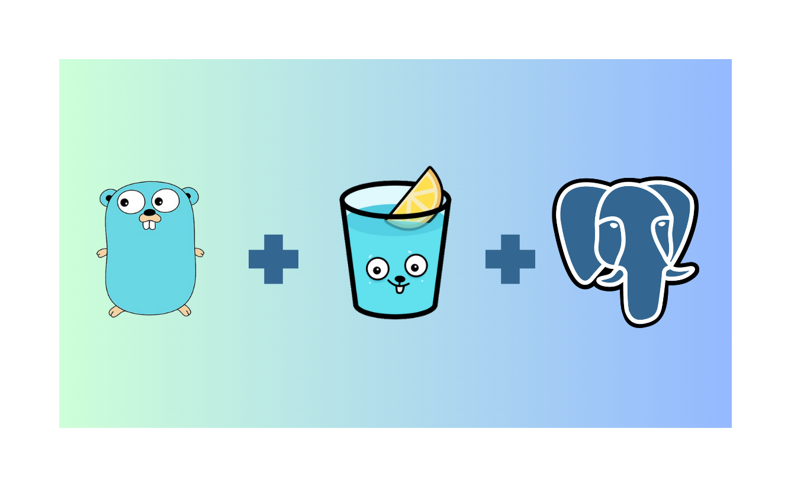

## go-simple-crud

A simple API CRUD project using Go as base language, Gin as web framework, and PostgreSQL as database.
You may also wanna see the documentation about the materials :
- Go : https://go.dev/doc/
- Gin : https://gin-gonic.com/docs/
- PostgreSQL : https://www.postgresql.org/docs/
